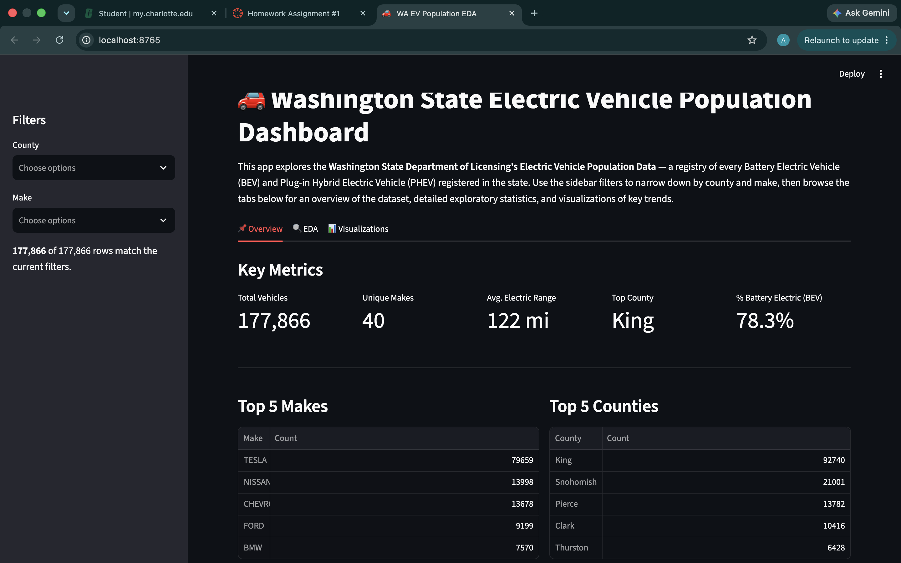
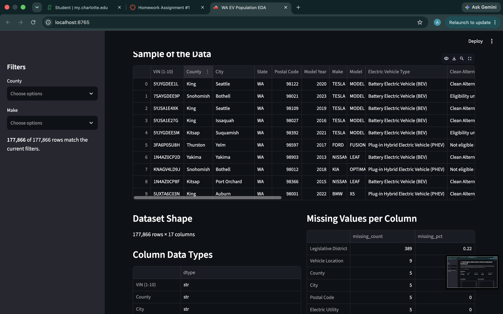
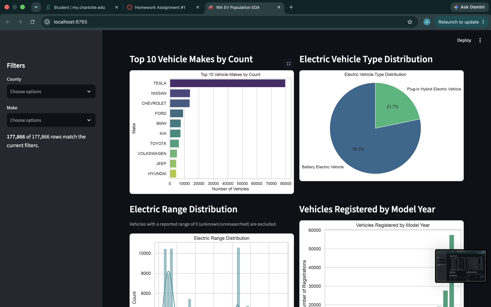

# Washington State Electric Vehicle Population EDA

**Author:** Arnav Earve
**Course:** DTSC 3601

## Project Description

This project is an interactive Streamlit dashboard exploring the Washington
State Department of Licensing's Electric Vehicle Population Data. The dataset
contains registration records for every Battery Electric Vehicle (BEV) and
Plug-in Hybrid Electric Vehicle (PHEV) registered in the state, including
make, model, model year, electric range, county/city, and more.

## Dataset

- **Source:** Kaggle - "Electric Vehicle Population Data"
- **File:** `Electric_Vehicle_Population_Data.csv`
- **Rows:** 177,866
- **Columns:** 17

## How to Run

Then open the local URL shown in the terminal (e.g. `http://localhost:8501`) in your browser.

## Features

- Sidebar filters by County and Make
- Overview tab with key metrics (total vehicles, unique makes, average electric range, top county, percent battery electric)
- EDA tab with a data sample, dataset shape, column data types, and missing value counts
- Visualizations tab with charts: top 10 vehicle makes, EV type distribution, electric range distribution, registrations by model year, and top counties

## Screenshots

### Overview

### EDA

### Visualizations

## Tech Stack

Python, Streamlit, pandas, matplotlib, seaborn, uv (package manager)
